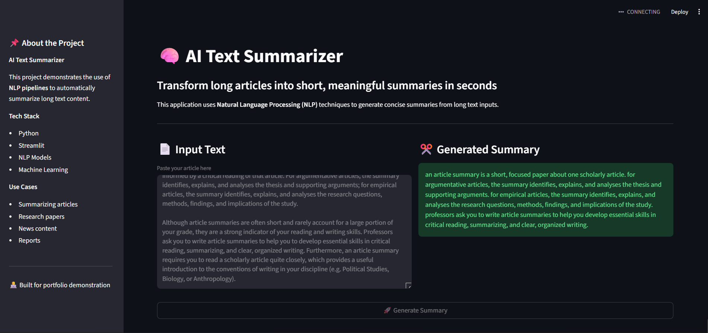

# 🧠 AI Text Summarizer (NLP Project)

An **end-to-end Natural Language Processing project** that summarizes long articles into short, meaningful summaries using a  **Transformer-based T5 model** .

The project demonstrates the  **complete ML lifecycle** :

**Data → Preprocessing → Model Training → Evaluation → Deployment (Streamlit App)**

Built with  **Python, HuggingFace Transformers, PyTorch, and Streamlit** .

---

# 🚀 Live Application Preview



The application allows users to:

• Paste long articles
• Generate concise summaries instantly
• Interact with a clean AI-powered web interface

---

# ✨ Features

🔹 Transformer-based **Abstractive Text Summarization**
🔹 **T5 fine-tuned model** for summarization
🔹 Modular **NLP pipeline architecture**
🔹 Interactive **Streamlit web interface**
🔹 Jupyter notebooks for **EDA and model training**
🔹 Clean, scalable **project structure**

---

# 🧠 Model

This project uses **T5 (Text-to-Text Transfer Transformer)** for abstractive summarization.

Unlike extractive methods, **T5 generates summaries in natural language rather than copying sentences from the input text.**

Example:

Input

```
Long article about climate change impacts on agriculture.
```

Output

```
Climate change significantly affects agricultural productivity through temperature changes and extreme weather events.
```

---

# 📊 Project Workflow

```
Raw Dataset
    │
    ▼
Data Ingestion
    │
    ▼
Data Preprocessing
    │
    ▼
T5 Model Training
    │
    ▼
Model Evaluation
    │
    ▼
Inference Pipeline
    │
    ▼
Streamlit Application
```

---

# 📂 Project Structure

```
NLP-TEXT-SUMMARIZER
│
├── data
│
├── models
│   ├── checkpoint-125
│   └── t5_summarizer
│
├── notebooks
│   ├── EDA.ipynb
│   └── model_training.ipynb
│
├── src
│   ├── data_ingestion.py
│   ├── data_preprocessing.py
│   ├── evaluate.py
│   ├── model.py
│   └── pipeline.py
│
├── streamlit.py
├── requirements.txt
└── README.md
```

---

# 📘 Notebooks

### 📊 Exploratory Data Analysis

`EDA.ipynb`

Contains:

• Dataset exploration
• Data distribution analysis
• Data cleaning steps
• Insights about the summarization dataset

---

### 🤖 Model Training

`model_training.ipynb`

Includes:

• Tokenization using T5 tokenizer
• Dataset preparation
• Fine-tuning the T5 model
• Training configuration
• Evaluation metrics

---

# ⚙️ Tech Stack

| Category        | Tools                    |
| --------------- | ------------------------ |
| Programming     | Python                   |
| NLP Framework   | HuggingFace Transformers |
| Deep Learning   | PyTorch                  |
| Model           | T5 Transformer           |
| Interface       | Streamlit                |
| Data Analysis   | Pandas, NumPy            |
| Experimentation | Jupyter Notebook         |

---

# 💻 Installation

Clone the repository

```
git clone https://github.com/samarthakur412/nlp-text-summarizer.git
cd nlp-text-summarizer
```

Create a virtual environment

```
python -m venv venv
```

Activate the environment

**Windows**

```
venv\Scripts\activate
```

**Mac/Linux**

```
source venv/bin/activate
```

Install dependencies

```
pip install -r requirements.txt
```

---

# ▶️ Running the Application

Run the Streamlit app

```
streamlit run streamlit.py
```

Open your browser

```
http://localhost:8501
```

---

# 📈 Future Improvements

• Add **PDF and document summarization**
• Deploy using **Docker + Cloud (AWS / GCP)**
• Build **REST API using FastAPI**
• Add **ROUGE score visualization dashboard**
• Support **multilingual summarization**

---

# 🎯 Key Learning Outcomes

This project demonstrates:

✔ Transformer-based NLP modeling
✔ Fine-tuning pretrained models
✔ Building modular ML pipelines
✔ Deploying ML models with Streamlit
✔ Structuring production-ready ML projects

---

# 👨‍💻 Author

Developed as part of a  **Machine Learning & NLP portfolio project** .

If you found this project useful, please ⭐ the repository.
